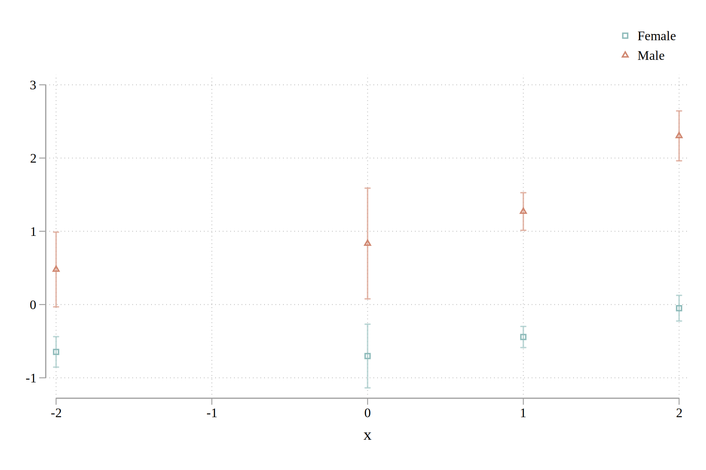

# esplot: a stata package for event study plots

Event study plots are increasingly popular in applied research. `esplot` is a new command for stata allowing researchers to quickly and easily create event study plots.

## Install

1. Install from within stata

   `net install esplot, from("https://raw.githubusercontent.com/dballaelliott/esplot/pkg/")`

2. Download/clone from github

   The github repository can be found [here](https://github.com/dballaelliott/esplot).

## Key Features

While there are many approaches to creating event study plots, most require data transformation (i.e. converting to event time, or creating vectors of event "leads and lags"). This package is designed to remove this step, and allow researches with <span id="a2">[panel data](#f2 "Must be able to be tsset: read more")</span> to quickly and easily generate event study plots.  

syntax is intentionally simple...  

`esplot paygrade, by(male) event(to_male_mgr) window(-20 30)`


... but is also flexible enough to allow for a range of powerful specifications and customizations. 
```stata
esplot paygrade, \\\
    by(male) event(to_male_mgr, replace save)  \\\ 
    compare(to_fem_mgr, replace save) \\\
    absorb(idn i.male##i.monthn) vce(cluster idn mgr_id)  \\\
    window(-30 30) period_length(3) estimate_reference 
```


All that we were <span id="a3">*[required](#fn3 "While not required, specifying a window is highly recommended.")*</span> to type is the dependent variable and an event dummy. For example:

`esplot paygrade, event(to_male_mgr)`

 `esplot` does the work behind the scenes to generate a full vector of event "lags" and "leads", so that the researcher can directly call `esplot` with minimal additional cleaning. While `by` is not explicitly required; easy comparison across groups however, is at the heart of many event studies.


### Smoothing over time periods

In our example, we have 51 time periods t = [-20,30]; with confidence intervals and more than two groups these figures can get "crowded" fast! Additionally, pooling coefficients can increase power and tighten confidence intervals. A set of point estimates that are *individually* insignificant can often be *jointly* significant.

The argument `period_length` takes an integer and allows users to smooth individual estimates over larger time periods. 

For example, we could have instead typed 

```stata
set scheme s1rcolor
esplot paygrade, by(male) event(to_male_mgr) \\\
window(-20 30) period_length(3)
```  


or

```stata
set scheme s1color
esplot paygrade, by(male) event(to_male_mgr) \\\
window(-24 30) period_length(12)
``` 



Since the underlying time periods are months, when we set period length to 3, we recover quarter level estimates. When we set period length to 12, we recover <span id="a1"> [annual estimates](#f1 "esplot will trim extraneous periods: read more")</span>. 

 **The estimate for t=0 is never smoothed, and is always only the event indicator,** i.e. exactly the estimate of the passed event indicator.

As you may have inferred from the examples above, when the `colors` option is not specified, `esplot` defers to the settings of the current scheme.

### Confidence Interval and Estimate Display Options

`esplot` has out of the box support for certain plot types for confidence intervals and for estimates.  

### Creating custom plots

Further customization is available for interested users; the option `savedata(filename [, replace])` will cause the coefficents, 95% confidence intervals, standard errors of the estimates, as well as p-values to be saved to `event_study_coefs.dta` (`replace` allows `esplot` to save over the existing version of  `event_study_coefs.dta`, if it exists). This then allows the user to create their own plot from these estimates. It can also be useful for users who wish to report detailed estimates of coefficients or p-values in a particular time period when discussing an event study plot.

 ```stata
import delimited "training2.csv", clear

**include replace in case we want to do this iteratively**
 esplot paygrade, by(male) event(to_male_mgr) \\\
    window(-20 30) period_length(12) \\\
    savedata(event_study_coefs, replace)

 use event_study_coefs, clear

 /* custom plot code */
 graph export custom_plot.svg, replace
 ```  

### Coming Soon

Even more fun things still to come! More graphical options; bounds on attrition...

## Acknowledgements

This package was developed as an extension of code written for  
> [Cullen, Zoë B., and Ricardo Perez-Truglia. _The Old Boys' Club: Schmoozing and the Gender Gap._ No.w26530. NBER, 2019.](https://www.nber.org/papers/w26530)
 
in my capacity as a research assistant to the authors.  

Katherine Fang and Jenna Anders made extensive contributions to early versions of the underlying code, which this package extends. Zoë Cullen and Ricardo Perez-Truglia guided development. Any remaining errors are mine.

<!-- https://stackoverflow.com/questions/25579868/how-to-add-footnotes-to-github-flavoured-markdown -->
<!-- <hr> -->
<hr>

[↩](#a2 "Back") <span id="f2">Since `esplot` relies on time series functions to track individuals over time, data must be `tsset` before calling `esplot`.</span>

 [↩](#a3 "Back") <span id="fn3"> The `window(numlist)` option tells `esplot` how many periods before and after the event it should try to plot. When the option is not specified, it will estimate an event window equal to twice the time span of the entire panel. This can cause runtime to be poor; especially in large datasets. In practice, there are often few or no observations near the endpoints of the panel (i.e. at event time t= +/- T), and so these time periods fall out. There is a still a runtime cost.
 </span>


 [↩](#a1 "Back") <span id="f1">Since -20 and 30 are not evenly divisible by 3, `esplot` effectively truncates the window to [-18,30].</span>

 